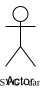
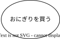
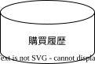

<!-- markdownlint-disable-file MD003 -->
<!-- markdownlint-disable-file MD022 -->
<!-- markdownlint-disable-file MD024 -->

# 文法と意味

ユースケース図は、いくつかの種類のノードをつないだ有向グラフで表現します。
このシステムに登場する人物(アクター)と使い方(ユースケース)の関係を明確にします。
そうすることで [エンドユーザがどのようにそのシステムを使うことを想定してるかを示す図です。]{.red-text-emphasis}

::: important
今回紹介する文法は、厳密なユースケース図の文法(UML)とは異なります。
文法よりもわかりやすさを優先させるために、アクターとユースケース以外に「ストレージ」というノードを追加しました。
システム上、どんなデータセットが登場するかを説明するために、このノードを追加しました。
UMLの規則を最優先する場合は、
[このストレージのノードは削除して図を提示してください。]{.blue-text-emphasis}
:::

## 要素

| 要素名       | 意味                                   |
| ------------ | -------------------------------------- |
| アクター     | システムの登場人物です                 |
| ユースケース | アクターが何をするかを動詞で記述します |
| ストレージ   | ユースケースの目的語になる要素です     |

### アクター

アクターはシステムの登場人物です。
棒人間で表し下に「役名」を記述します。
もともとアクター(actor)は「俳優」という意味があります。
その登場人物がシステム上どういう「役」を演じるかという視点で設定してください。
アクターは可能な限り具体的な役割を与えるようにしましょう。

#### %fa-solid fa-face-smile%(.blue-text) よい例

* [その人の行為が入っている名前]{.blue-text-emphasis}
  * 買い物をする人、商品を選ぶ人、在庫の台帳を確認する人
* [的確な役割の名前]{.blue-text-emphasis}
  * 店長、一般店員、会員登録ユーザ、非登録ユーザ
* [実社会の役割]{.blue-text-emphasis}
  * 部門長、出納係、調達部門

#### %fa-solid fa-face-dizzy%(.red-text) よくない例

* [一般用語]{.red-text-emphasis}
  * 利用者、管理者、ユーザ
* [人の名前]{.red-text-emphasis}
  * 松本さん、斎藤さん、John、Bob

::container
---
icon: fa-solid fa-circle-exclamation
title: 注意
color: red
---

実世界でひとりでもアクターが二つになる場合があります。
例えば、コンビニエンスストアの店員は、「レジを打ち係」と「品出し係」のふたつのアクターに割り当てるのが自然です。

::

### ユースケース

ユースケースには、アクターがそのシステムを「どう使うか」を丸囲みで記述します。
アクターを主語や目的語とした場合の述語を記述します。
述語を記述するので、ユースケースの最後の文字列は多くの場合「～する」と記述します。

::container
---
icon: fa-solid fa-thumbs-up
title: ヒント
color: green
---

システムエンジニアは、ユースケースより機能(フィーチャー)を割り当てがちです。
いかに「機能」の例を挙げます。このようなユーケースを割り当てないでください。

::

### ストレージ

::container
---
icon: fa-solid fa-circle-exclamation
title: 注意
color: red
---

「ストレージ」はUMLのユースケース図では未定義です。
世の中の仕組みを理解するうえで、「データ」がどこにあり、どのように使われるのかを理解することはとても重要です。
本ドキュメントでは、しかけをわかりやすくするために、ユースケースでアクセスするデータを明確にするという目的で、文法を拡張しました。

::

## 関係性

### 主語と述語、目的語

### 継承と実装

### 包含と拡張
